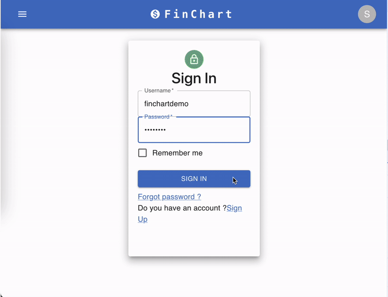
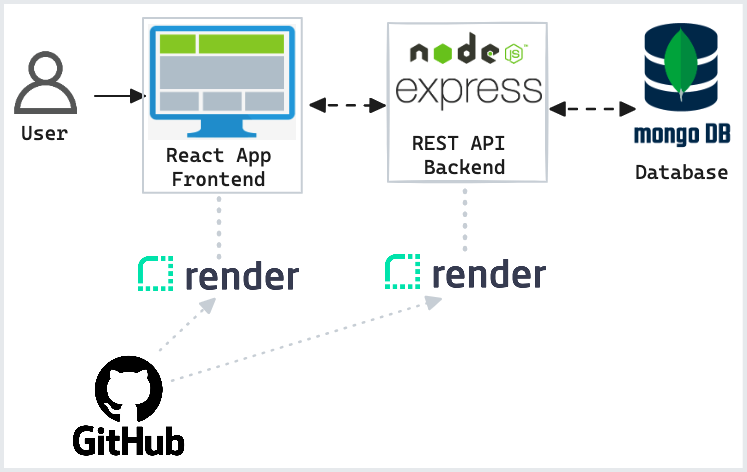

# FinChart Web App

MVP Web app for creating financial snapshots for networth and budgeting. Track data every quarter and generate charts without using a spreadsheet.

      



## 🎯 Project Overview

- Designed modern and responsive frontend with **React** and **Material UI**
- Developed **RESTful API** to interface with **NoSQL MongoDB** database
- Implemented simple JSON file import/export for user data
- Secured client and server authentication with **JSON Web Tokens (JWT)**, storing tokens securely in browser HttpOnly cookies
- Automated continuous integration with **GitHub Actions**, enforcing ESLint **code styling**, build and test
- Simplified deployment with [Render](https://dashboard.render.com/) to host API and Client on one platform

## Architecture



## 📦 Tech Stack

- React
- MaterialUI
- MongoDB
- Express/Node

🚀 Deployed with [Render](https://dashboard.render.com/)

## ⚙️ Local Development

> Also refer to [DEPLOYMENT.md](./docs/DEPLOYMENT.md) and [CONTINUOUS_INTEGRATION.md](./docs/CONTINUOUS_INTEGRATION.md)

```sh
yarn install
cp .env.sample api/.env
yarn run dev
# open localhost:5000
```

## 🌟 Features

### Login/Logout

<image width="600px" alt="Image" src="./docs/AuthFeature.png"/>

### View Reports

<image width="600px" alt="Image" src="./docs/ViewReports.png"/>

<image width="600px" alt="Image" src="./docs/ViewOneReport.png"/>

<image width="600px" alt="Image" src="./docs/ReportSpendingChart.png"/>

### Create/Edit Reports

<image width="600px" alt="Image" src="./docs/CreateReport.png"/>

### Import/Export JSON Report

<image width="600px" alt="Image" src="./docs/ImportReport.png"/>

### Track Snapshots Over Time

<image width="600px" alt="Image" src="./docs/NetworthFeature.png"/>
